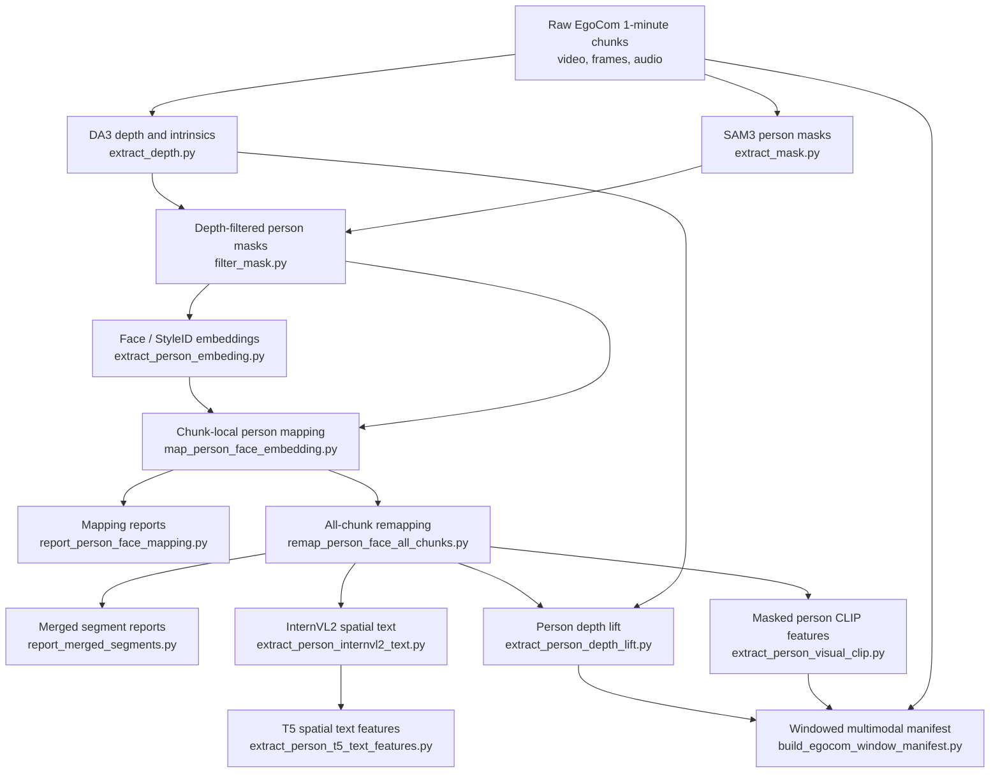

# EgoCom Preprocessing Procedure

This file is a compact overview of the preprocessing order. Detailed stage-level explanations are kept in the existing HTML files linked below.

## Progress Diagram

## Stage Links

| Order | Stage | Main script | Primary output | Detailed HTML reference |
| --- | --- | --- | --- | --- |
| 0 | Source chunks | Existing dataset layout | `/home/prj/data/egocom_holdout/1min/{split}` and original audio | Input prerequisite |
| 1 | DA3 depth and intrinsics | `extract_depth.py` | `{split}/da3/monocular`, `{split}/da3/nested` | Used by [Depth-Based Mask Refinement](filter_mask_explanation.html) and [Person Depth Lift](person_depth_lift_explanation.html) |
| 2 | SAM3 person masks | `extract_mask.py` | `{split}/person_mask/{video}` | Input to [Depth-Based Mask Refinement](filter_mask_explanation.html) |
| 3 | Depth-filter masks | `filter_mask.py` | `{split}/refined_mask/{video}` | [Depth-Based Mask Refinement](filter_mask_explanation.html) |
| 4 | Extract face embeddings | `extract_person_embeding.py` | Per-video face embedding outputs from refined masks | [Person Face Embedding Extraction](extract_person_embeding_explanation.html) |
| 5 | Map segment IDs to scene person IDs | `map_person_face_embedding.py` | `{split}/person_face_mapping/{scene}` | [Face-Embedding Person Mapping](map_person_face_embedding_explanation.html) |
| 6 | Inspect mapping outputs | `report_person_face_mapping.py` | Mapping report HTML/JSON summaries | [Person Mapping Outputs Guide](person_face_report_outputs_guide.html), [Current Mapping Report](person_face_mapping_report.html) |
| 7 | Remap all chunks from selected prototypes | `remap_person_face_all_chunks.py` | `remap_all_chunks.json`, remap summaries | [All-Chunk Person Remapping](remap_person_face_all_chunks_explanation.html) |
| 8 | Inspect merged/remapped cases | `report_merged_segments.py` | Merged segment report files | [Person Mapping Outputs Guide](person_face_report_outputs_guide.html) |
| 9a | Lift mapped persons into depth summaries | `extract_person_depth_lift.py` | `{split}/person_depth_lift/{scene}/person_{id}` | [Person Depth Lift](person_depth_lift_explanation.html) |
| 9b | Extract masked visual CLIP features | `extract_person_visual_clip.py` | `{split}/person_visual_clip_features/{scene}/person_{id}` | [Masked Person CLIP Features](person_visual_clip_explanation.html) |
| 9c | Generate spatial text | `extract_person_internvl2_text.py` | `{split}/person_spatial_internvl2_text/{scene}/person_{id}` | [Person Spatial Text Features](person_spatial_text_features_explanation.html) |
| 10c | Encode spatial text with T5 | `extract_person_t5_text_features.py` | `{split}/person_spatial_t5_features/{scene}/person_{id}` | [Person Spatial Text Features](person_spatial_text_features_explanation.html) |
| 11 | Build windowed multimodal manifest | `build_egocom_window_manifest.py` | `{output_tag}/{split}/jsonl/manifest.jsonl`, audio windows, depth rays, CLIP features | Final packaging step |

## Dependency Notes

- Stages `9a`, `9b`, and `9c` can run after all-chunk remapping is available.
- The window manifest currently consumes person depth-lift outputs, person visual CLIP features, and original audio.
- Spatial text and T5 features are produced as a parallel person-level feature branch.
