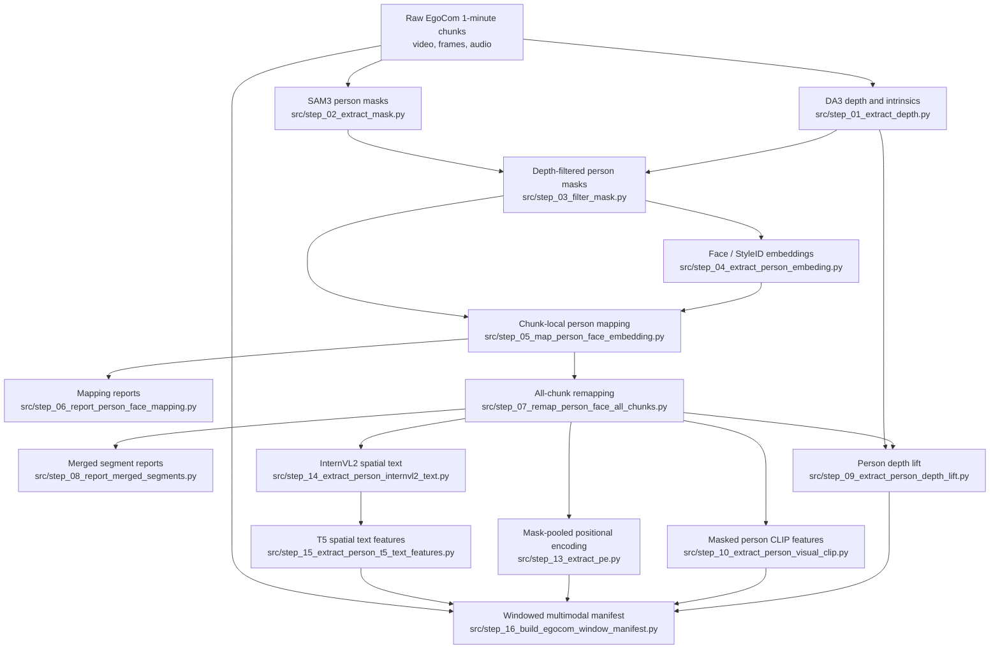

# EgoCom Preprocessing Procedure

This file is a compact overview of the preprocessing order. Detailed stage-level explanations are kept in the existing HTML files linked below.

## Progress Diagram

Use the table below to open each detailed HTML reference.

## Stage Links

| Order | Stage | Detailed HTML reference | Main script | Primary output |
| --- | --- | --- | --- | --- |
| 0 | Source chunks | Input prerequisite | Existing dataset layout | `/home/prj/data/egocom_holdout/1min/{split}` and original audio |
| 1 | DA3 depth and intrinsics | Used by [Depth-Based Mask Refinement](https://htmlpreview.github.io/?https://github.com/beautifulchoi/egocom-preprocess/blob/main/docs/step/step_03_filter_mask_explanation.html) and [Person Depth Lift](https://htmlpreview.github.io/?https://github.com/beautifulchoi/egocom-preprocess/blob/main/docs/step/step_09_person_depth_lift_explanation.html) | `src/step_01_extract_depth.py` | `{split}/da3/monocular`, `{split}/da3/nested` |
| 2 | SAM3 person masks | Input to [Depth-Based Mask Refinement](https://htmlpreview.github.io/?https://github.com/beautifulchoi/egocom-preprocess/blob/main/docs/step/step_03_filter_mask_explanation.html) | `src/step_02_extract_mask.py` | `{split}/person_mask/{video}` |
| 3 | Depth-filter masks | [Depth-Based Mask Refinement](https://htmlpreview.github.io/?https://github.com/beautifulchoi/egocom-preprocess/blob/main/docs/step/step_03_filter_mask_explanation.html) | `src/step_03_filter_mask.py` | `{split}/refined_mask/{video}` |
| 4 | Extract face embeddings | [Person Face Embedding Extraction](https://htmlpreview.github.io/?https://github.com/beautifulchoi/egocom-preprocess/blob/main/docs/step/step_04_extract_person_embeding_explanation.html) | `src/step_04_extract_person_embeding.py` | Per-video face embedding outputs from refined masks |
| 5 | Map segment IDs to scene person IDs | [Face-Embedding Person Mapping](https://htmlpreview.github.io/?https://github.com/beautifulchoi/egocom-preprocess/blob/main/docs/step/step_05_map_person_face_embedding_explanation.html) | `src/step_05_map_person_face_embedding.py` | `{split}/person_face_mapping/{scene}` |
| 6 | Inspect mapping outputs | [Person Mapping Outputs Guide](https://htmlpreview.github.io/?https://github.com/beautifulchoi/egocom-preprocess/blob/main/docs/step/step_06_person_face_report_outputs_guide.html), [Current Mapping Report](https://htmlpreview.github.io/?https://github.com/beautifulchoi/egocom-preprocess/blob/main/docs/step/step_06_person_face_mapping_report.html) | `src/step_06_report_person_face_mapping.py` | Mapping report HTML/JSON summaries |
| 7 | Remap all chunks from selected prototypes | [All-Chunk Person Remapping](https://htmlpreview.github.io/?https://github.com/beautifulchoi/egocom-preprocess/blob/main/docs/step/step_07_remap_person_face_all_chunks_explanation.html) | `src/step_07_remap_person_face_all_chunks.py` | `remap_all_chunks.json`, remap summaries |
| 8 | Inspect merged/remapped cases | [Person Mapping Outputs Guide](https://htmlpreview.github.io/?https://github.com/beautifulchoi/egocom-preprocess/blob/main/docs/step/step_06_person_face_report_outputs_guide.html) | `src/step_08_report_merged_segments.py` | Merged segment report files |
| 9a | Lift mapped persons into depth summaries | [Person Depth Lift](https://htmlpreview.github.io/?https://github.com/beautifulchoi/egocom-preprocess/blob/main/docs/step/step_09_person_depth_lift_explanation.html) | `src/step_09_extract_person_depth_lift.py` | `{split}/person_depth_lift/{scene}/person_{id}` |
| 9b | Extract masked visual CLIP features | [Masked Person CLIP Features](https://htmlpreview.github.io/?https://github.com/beautifulchoi/egocom-preprocess/blob/main/docs/step/step_10_person_visual_clip_explanation.html) | `src/step_10_extract_person_visual_clip.py` | `{split}/person_visual_clip_features/{scene}/person_{id}` |
| 9c | Extract positional encoding features | [Mask-Pooled Positional Encoding](docs/step/step_13_extract_pe_explanation.html) | `src/step_13_extract_pe.py` | `{split}/person_pe_features/{scene}/person_{id}` |
| 9d | Generate spatial text | [Person Spatial Text Features](https://htmlpreview.github.io/?https://github.com/beautifulchoi/egocom-preprocess/blob/main/docs/step/step_14_person_spatial_text_features_explanation.html) | `src/step_14_extract_person_internvl2_text.py` | `{split}/person_spatial_internvl2_text/{scene}/person_{id}` |
| 10d | Encode spatial text with T5 | [Person Spatial Text Features](https://htmlpreview.github.io/?https://github.com/beautifulchoi/egocom-preprocess/blob/main/docs/step/step_14_person_spatial_text_features_explanation.html) | `src/step_15_extract_person_t5_text_features.py` | `{split}/person_spatial_t5_features/{scene}/person_{id}` |
| 11 | Build windowed multimodal manifest | Final packaging step | `src/step_16_build_egocom_window_manifest.py` | `{output_tag}/{split}/jsonl/manifest.jsonl`, audio windows, depth rays, CLIP, PE, and T5 features |

## Dependency Notes

- Stages `9a`, `9b`, `9c`, and `9d` can run after all-chunk remapping is available.
- The window manifest currently consumes person depth-lift outputs, person visual CLIP features, mask-pooled PE features, T5 features, and original audio.
- Spatial text/T5 and PE features are produced as parallel person-level feature branches.
