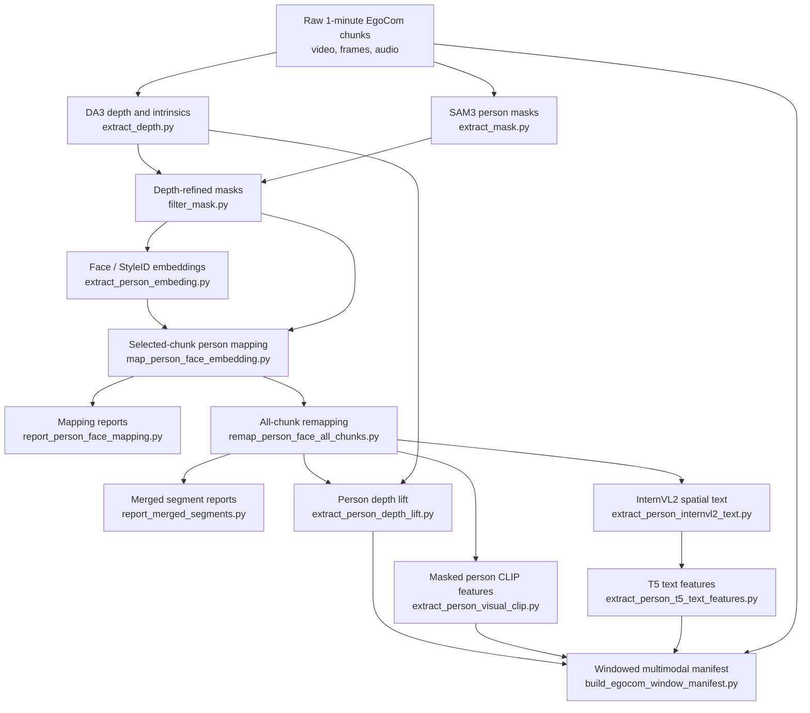

# EgoCom Preprocessing Procedure

This document aggregates the repository README and the HTML stage descriptions into one end-to-end view of how the EgoCom preprocessing pipeline proceeds. The pipeline starts from raw 1-minute EgoCom chunks and produces person-aware, frame-aligned multimodal windows with audio, geometry, visual CLIP features, and spatial text features.

## Overall Flow



The key dependency chain is:

1. Prepare frames, video, and audio under `/home/prj/data/egocom_holdout/1min/{split}`.
2. Produce depth and camera intrinsics with DA3.
3. Produce SAM3 person masks.
4. Refine those masks with depth discontinuity checks.
5. Extract face identity embeddings for each surviving local segment id.
6. Map local segment ids to real scene person ids.
7. Remap every chunk using the selected stable person prototypes.
8. Generate person-level geometry, visual, and language features.
9. Build short train, validation, and test windows from the 1-minute chunks.

## Stage Summary

| Order | Stage | Script | Main Inputs | Main Outputs |
| --- | --- | --- | --- | --- |
| 0 | Source chunks | Existing dataset layout | Videos, frames, audio | `/home/prj/data/egocom_holdout/1min/{split}` |
| 1 | DA3 depth and intrinsics | `extract_depth.py` | Frame folders | `{split}/da3/monocular`, `{split}/da3/nested` |
| 2 | SAM3 person masks | `extract_mask.py` | Videos or frame folders | `{split}/person_mask/{video}` |
| 3 | Depth-refined masks | `filter_mask.py` | SAM masks, DA3 depth | `{split}/refined_mask/{video}/mask.pt` |
| 4 | Face embeddings | `extract_person_embeding.py` | Refined masks, frames | `{split}/person_face_emb/{video}/embeding.pt` |
| 5 | Selected-chunk mapping | `map_person_face_embedding.py` | Refined masks, face embeddings | `{split}/person_face_mapping/{scene}/mapping.json` |
| 6 | Mapping reports | `report_person_face_mapping.py` | Mapping outputs | Split and dataset HTML/JSON reports |
| 7 | All-chunk remapping | `remap_person_face_all_chunks.py` | Selected chunk prototypes, all chunk embeddings | `{split}/person_face_mapping/{scene}/remap_all_chunks.json` |
| 8 | Merged segment reports | `report_merged_segments.py` | Remap outputs | `{split}/person_face_mapping/merged_segments_report.html` |
| 9a | Person depth lift | `extract_person_depth_lift.py` | Remap chains, refined masks, face boxes, DA3 depth, intrinsics | `{split}/person_depth_lift/{scene}/person_{id}/{video}.npz` |
| 9b | Masked person CLIP | `extract_person_visual_clip.py` | Remap chains, refined masks, frames | `{split}/person_visual_clip_features/{scene}/person_{id}/{video}.pt` |
| 9c | Spatial text | `extract_person_internvl2_text.py` | Remap chains, refined masks, frames | `{split}/person_spatial_internvl2_text/{scene}/person_{id}/{video}.txt` |
| 10c | T5 text features | `extract_person_t5_text_features.py` | InternVL2 text | `{split}/person_spatial_t5_features/{scene}/person_{id}/{video}.pt` |
| 11 | Window manifest | `build_egocom_window_manifest.py` | Audio, depth lift, CLIP, T5 features | Window sidecars and `manifest_mm.jsonl` |

## 0. Source Dataset Layout

The pipeline assumes the EgoCom holdout data is organized by split under:

```text
/home/prj/data/egocom_holdout/1min/{split}/
```

Common split-level subdirectories are:

```text
video/{video_name}.mp4
frame/{video_name}/frame_XXXXXX.jpg
audio or original audio sources used by the window builder
```

Clip names encode scene membership:

```text
vid_*__day_*__con_*__person_*[_partN]_chunk_*
```

Scene keys include the optional part suffix, for example `day_1__con_1__part1`; otherwise the key is `day_X__con_Y`.

## 1. Extract DA3 Depth and Intrinsics

`extract_depth.py` runs Depth Anything 3 on frame folders. It writes metric monocular depth maps and DA3 camera intrinsics aligned to the resized DA3 grid.

Primary outputs:

```text
{split}/da3/monocular/{video_name}/depth/{frame_stem}.npy
{split}/da3/monocular/{video_name}/vis/{frame_stem}.jpg
{split}/da3/nested/{video_name}/camera_params/intrinsics.npy
```

The depth maps are later used by `filter_mask.py` to reject weak SAM masks and by `extract_person_depth_lift.py` to back-project mapped person pixels into camera-space summaries. The intrinsics are required for the depth-lift step.

## 2. Extract SAM3 Person Masks

`extract_mask.py` extracts person masks for EgoCom 1-minute chunks using SAM3. It can work from videos or pre-existing frame folders. It supports split selection, limits, GPU selection, skip-existing behavior, and sharded processing.

Typical commands:

```bash
python /home/prj/egocom_preprocess/extract_mask.py --splits train --limit 1
python /home/prj/egocom_preprocess/extract_mask.py --splits train,val --skip_existing --sam_gpus 0
python /home/prj/egocom_preprocess/extract_mask.py --splits train --num_shards 8 --shard_index 0
```

The mask payload is a frame-indexed dictionary of segment ids and boolean masks. These raw SAM masks are treated as an input artifact. Later refinement writes a copy rather than modifying the original masks.

## 3. Refine Masks With Depth

`filter_mask.py` filters SAM person masks with DA3 depth maps. Its central rule is frame-level rejection: it removes a specific `(frame_idx, segment_id)` only when that instance lacks enough depth discontinuity from its local surroundings. It does not delete a segment id globally unless every frame instance of that id is rejected.

Input and output paths:

```text
Input:  {split}/person_mask/{video}/masks.pt
Input:  {split}/da3/monocular/{video}/depth/{frame}.npy
Output: {split}/refined_mask/{video}/mask.pt
Output: {split}/refined_mask/{video}/summary.json
Output: {split}/refined_mask/{video}/vis/*.jpg
```

For every frame and segment id, the script resizes the mask to the depth grid, dilates it, and compares valid depth inside the mask to a surrounding outer ring. It computes both median mask-to-ring contrast and robust boundary contrast, then uses:

```text
depth_discontinuity_score = max(median_relative_depth_diff, robust_boundary_score)
```

A frame instance is rejected only when the score is below `--depth_diff_thresh`. Skipped cases with too few valid mask or ring pixels are kept because there is not enough evidence to reject them.

Important defaults:

| Parameter | Default | Meaning |
| --- | --- | --- |
| `--depth_diff_thresh` | `0.06` | Reject below 6 percent discontinuity. |
| `--dilate_radius` | `5` | Expansion radius for the outer ring. |
| `--local_edge_thresh` | `0.08` | Outer-ring pixel contrast needed for edge evidence. |
| `--min_edge_fraction` | `0.08` | Fraction of ring pixels needed before trusting boundary evidence. |
| `--boundary_quantile` | `90` | Quantile used for robust boundary contrast. |
| `--min_mask_pixels`, `--min_ring_pixels` | `25`, `25` | Minimum valid pixels needed for scoring. |

Typical commands:

```bash
python /home/prj/egocom_preprocess/filter_mask.py --overwrite
python /home/prj/egocom_preprocess/filter_mask.py --dry_run
```

## 4. Extract Face Identity Embeddings

`extract_person_embeding.py` extracts per-segment face identity embeddings from refined masks. It uses InsightFace only for face detection and StyleID, implemented through Hugging Face `CLIPModel`, for the final embedding vectors.

Inputs and outputs:

```text
Input:  {split}/refined_mask/{video_name}/mask.pt
Input:  {split}/frame/{video_name}/*.jpg
Output: {split}/person_face_emb/{video_name}/embeding.pt
Output: {split}/person_face_emb/{video_name}/summary.json
```

The script processes each mask instance by:

1. Loading the refined frame-to-segment mask dictionary.
2. Cropping the person mask box with `--person_padding`.
3. Setting pixels outside the person mask to black before face detection.
4. Running InsightFace detection on the masked person crop.
5. Selecting the detected face with the best overlap against the person mask, using detector confidence as a tie breaker.
6. Mapping the face box back to full-frame coordinates.
7. Expanding the face box with `--face_padding`.
8. Passing the original-frame face crop to StyleID.
9. Saving normalized 768-dimensional vectors per valid segment id.

Segments with no valid face detection are not saved as zero vectors. They are omitted from `embeding.pt` and listed in `summary.json` under invalid segment fields.

Useful defaults:

| Parameter | Default | Meaning |
| --- | --- | --- |
| `--sample_every` | `1` | Process every Nth frame. |
| `--det_size` | `640` | InsightFace detector input size. |
| `--min_face_score` | `0.3` | Minimum detector confidence. |
| `--person_padding` | `0.08` | Padding around the person mask box for detection. |
| `--face_padding` | `0.25` | Padding around the selected face crop for StyleID. |
| `--device` | `auto` | Uses CUDA when available, otherwise CPU. |

Example commands:

```bash
python /home/prj/egocom_preprocess/extract_person_embeding.py --split train --video vid_001__day_1__con_1__person_1_part1_chunk_0001 --overwrite

python /home/prj/egocom_preprocess/extract_person_embeding.py --mask_path /path/to/mask.pt --frame_dir /path/to/frame_dir --output_dir /tmp/person_face_emb_smoke --max_frames 30 --overwrite
```

If `--device auto` selects CUDA but ONNXRuntime does not provide `CUDAExecutionProvider`, the script raises an error rather than silently falling back for the detector.

## 5. Map Local Segments to Scene Person IDs

`map_person_face_embedding.py` maps clip-local refined-mask segment ids to real scene person ids using face embedding similarity. This first mapping pass selects a stable, conflict-free chunk for each scene and writes representative person prototypes.

Default command:

```bash
python /home/prj/egocom_preprocess/map_person_face_embedding.py --split train --save_vis
```

Focused smoke-test command:

```bash
python /home/prj/egocom_preprocess/map_person_face_embedding.py --split train --scene_key day_1__con_1__part1 --save_vis --overwrite
```

For each candidate chunk, the mapper reads:

```text
refined_mask/{clip}/summary.json
refined_mask/{clip}/mask.pt
person_face_emb/{clip}/embeding.pt
frame/{clip}/*.jpg
```

The mapping algorithm is:

1. Group clips by scene key and try chunks in ascending chunk order.
2. Select at most two segment ids per clip by descending `remaining_person_frequency`.
3. Load embeddings for those selected ids only.
4. Exclude selected ids with fewer than 10 face embeddings.
5. Mean-pool and L2-normalize each valid segment embedding set.
6. For each camera pair, build a cosine similarity matrix.
7. Treat the best matrix cell as the shared-person match.
8. Accept `1x1` matches only when the score is at least `0.70`.
9. Infer the other visible person in a view when one valid segment is mapped and one other valid segment remains.
10. Record conflicts, missing embeddings, and low-count segments.
11. If a chunk has conflicts, try the next chunk.
12. If every chunk conflicts, keep the best-ranked attempt and record all attempts.

Scene-level outputs:

```text
{split}/person_face_mapping/{scene_key}/mapping.json
{split}/person_face_mapping/{scene_key}/summary.json
{split}/person_face_mapping/{scene_key}/details.json
{split}/person_face_mapping/{scene_key}/representative_embeddings.pt
{split}/person_face_mapping/{scene_key}/representative_crops/
```

The selected-chunk mapping establishes scene person labels and representative embeddings. It is not the final all-chunk chain file.

## 6. Inspect Mapping Reports

Mapping reports are for validation and debugging. The operational file for downstream dataset construction is the all-chunk remap JSON, but the reports help verify selected chunks, fallback behavior, unresolved cases, conflicts, and merged segments.

Important report files:

```text
/home/prj/data/egocom_holdout/1min/person_face_mapping_report.html
/home/prj/data/egocom_holdout/1min/person_face_mapping_report.json
{split}/person_face_mapping/report.html
{split}/person_face_mapping/report.json
{split}/person_face_mapping/{scene_key}/report.html
{split}/person_face_mapping/{scene_key}/details.json
```

Use these files after running `map_person_face_embedding.py` to check whether scenes resolved cleanly or needed fallback chunks.

## 7. Remap Every Chunk in Each Scene

`remap_person_face_all_chunks.py` takes the selected conflict-free chunk's representative embeddings as fixed person prototypes, then remaps every chunk in the same scene. It does not modify original or refined mask files. If multiple disconnected segment ids indicate the same real person, it records them as a merged group.

Command:

```bash
python /home/prj/egocom_preprocess/remap_person_face_all_chunks.py --split all_existing --save_vis --overwrite
```

The all-chunk process is:

1. Load selected representative person prototypes from the stable mapping pass.
2. For each chunk and local segment, mean-pool valid face embeddings.
3. Compare each segment to the fixed person prototypes.
4. Assign the best primary segment to each real person.
5. Add extra disconnected segment ids to a person's merged group when they are similar enough and do not substantially overlap in time.
6. Save compact mapping, detailed diagnostics, remapped representative embeddings, visualizations, and dataset summaries.

Merge defaults:

| Condition | Default |
| --- | --- |
| Minimum face embeddings per segment | `10` |
| Candidate segment similarity | `>= 0.70` |
| Candidate score gap from primary | `<= 0.10` |
| Frame overlap with current group | `<= 5` frames |

Primary outputs:

```text
{split}/person_face_mapping/{scene_key}/remap_all_chunks.json
{split}/person_face_mapping/{scene_key}/remap_all_chunks_details.json
{split}/person_face_mapping/{scene_key}/remap_representative_embeddings.pt
{split}/person_face_mapping/{scene_key}/remap_visualizations/{clip}/
{split}/person_face_mapping/remap_all_chunks_summary.json
/home/prj/data/egocom_holdout/1min/person_face_remap_all_chunks_summary.json
```

`remap_all_chunks.json` is the main chain file for dataset construction. It contains chunks, real people, primary segment ids, and merged segment ids.

## 8. Inspect Merged Segment Cases

`report_merged_segments.py` creates compact HTML and JSON reports listing visualization folders where a person has more than one segment id after all-chunk remapping.

Outputs:

```text
{split}/person_face_mapping/merged_segments_report.html
{split}/person_face_mapping/merged_segments_report.json
/home/prj/data/egocom_holdout/1min/merged_segments_report_summary.json
```

Use `merged_segments_report.html` to inspect disconnected tracks assigned to the same real person. The report header shows merged folders over total remap visualization folders.

## 9a. Lift Mapped Persons Into Camera-Space Depth Summaries

`extract_person_depth_lift.py` converts each mapped person mask into compact per-frame camera-space geometry. It combines final person mapping, refined segmentation, saved face detections, DA3 metric depth, and DA3 intrinsics.

Inputs and output:

```text
Input:  {split}/person_face_mapping/*/remap_all_chunks.json
Input:  {split}/refined_mask/{video}/mask.pt
Input:  {split}/person_face_emb/{video}/embeding.pt
Input:  {split}/da3/monocular/{video}/depth/frame_XXXXXX.npy
Input:  {split}/da3/nested/{video}/camera_params/intrinsics.npy
Output: {split}/person_depth_lift/{scene}/person_{id}/{video}.npz
```

For each mapped frame, the script aligns the refined mask and face bbox to the DA3 depth grid. It first lifts the intersection between the mapped mask and the saved face bbox; if the face bbox is missing or too small, it falls back to the full mapped mask. Selected depth pixels are back-projected with:

```text
x = ((u - cx) / fx) * z
y = ((v - cy) / fy) * z
d = sqrt(x^2 + y^2 + z^2)
```

Common frame statuses:

| Status | Meaning |
| --- | --- |
| `face_intersection` | Face bbox and mapped mask overlap had enough valid depth pixels. |
| `mask_fallback` | Face bbox was missing or too small, so the full mapped mask was lifted. |
| `discontinuity_rejected` | Mask boundary had too little depth evidence. |
| `insufficient_depth` | Selected region had too few finite positive depth pixels. |
| `absent_seg` | No mapped segment mask exists for that frame. |
| `missing_depth` | The DA3 depth file was missing or invalid. |

These `.npz` files become the geometry source for the window manifest.

## 9b. Extract Masked Person CLIP Features

`extract_person_visual_clip.py` produces visual CLIP features for each mapped person track. It unions one or more refined-mask segment ids for a person, keeps the full frame but blacks out everything outside the mapped person mask, then feeds the masked image to CLIP ViT-L/14.

Inputs and outputs:

```text
Input:  {split}/person_face_mapping/*/remap_all_chunks.json
Input:  {split}/refined_mask/{video}/mask.pt
Input:  {split}/frame/{video}/frame_XXXXXX.jpg
Output: {split}/person_visual_clip_features/{scene}/person_{id}/{video}.pt
Output: {split}/person_visual_clip_features/{scene}/person_{id}/visualizations/*.jpg
```

Each `.pt` file stores:

```text
features
frame_indices
frame_stems
segment_ids
mask_bboxes
mask_pixel_counts
source paths
has_masks
frame_statuses
```

Features are L2-normalized `float32` vectors with shape:

```text
(num_source_frames, 768)
```

If a frame has no mapped segment for that person, the extractor feeds a full black image so the sequence remains aligned to every source frame.

Command:

```bash
python /home/prj/egocom_preprocess/extract_person_visual_clip.py --split val
```

Use `--scene_key`, `--video`, or `--limit` for smaller runs, and `--overwrite` to regenerate existing feature files.

## 9c. Generate Spatial Text With InternVL2

`extract_person_internvl2_text.py` converts mapped person masks into frame-aligned spatial language. It uses the final remap chains, refined masks, and RGB frames to build a query pair: one image containing the masked person and one image containing the original frame. InternVL2 then writes one response line per frame.

Inputs and output:

```text
Input:  {split}/person_face_mapping/*/remap_all_chunks.json
Input:  {split}/refined_mask/{video}/mask.pt
Input:  {split}/frame/{video}/frame_*.jpg
Output: {split}/person_spatial_internvl2_text/{scene}/person_{id}/{video}.txt
```

A frame is written as literal `null` when:

```text
the mapped segment is absent
the frame cannot be read
the resized mask is empty
the union mask has fewer than 100 pixels
```

Example commands:

```bash
python /home/prj/egocom_preprocess/extract_person_internvl2_text.py --split val --limit 1 --dry_run --overwrite
python /home/prj/egocom_preprocess/extract_person_internvl2_text.py --split val --min_mask_pixels 100
```

## 10c. Encode Spatial Text With T5

`extract_person_t5_text_features.py` encodes the InternVL2 text into T5-XXL pooled text features while preserving frame alignment. Each text line corresponds to one source frame, and each feature vector corresponds to one text line.

Inputs and output:

```text
Input:  {split}/person_spatial_internvl2_text/{scene}/person_{id}/{video}.txt
Output: {split}/person_spatial_t5_features/{scene}/person_{id}/{video}.pt
```

The output stores 4096-dimensional T5-XXL features with frame metadata. `null` rows are still encoded as text so the one-to-one relationship among source frames, text lines, and feature vectors is preserved.

Command:

```bash
python /home/prj/egocom_preprocess/extract_person_t5_text_features.py --split val
```

## 11. Build Windowed Multimodal Manifest

`build_egocom_window_manifest.py` merges 1-minute chunk outputs into shorter multimodal samples. Each manifest row contains source and target audio windows, target geometry observed from the source camera, target CLIP visual features, and target T5 text features aligned on the same 5 FPS frame grid.

Default split policy:

| Split | Window | Stride | Extra Filtering | Default Output |
| --- | --- | --- | --- | --- |
| `train`, `val` | 6 seconds, 30 frames | 3 seconds, 15 frames | Ignored source chunks and non-empty target visual windows | `/home/prj/data/egocom_holdout/6s_overlap0.5/{split}` |
| `test` | 4 seconds, 20 frames | 4 seconds, 20 frames | No overlap, padded final tail, no fully absent target visual windows, target geometry valid ratio at least 0.25 | `/home/prj/data/egocom_holdout/4s_overlap0/test` |

The builder constructs a global 5 FPS timeline across chunk indices, samples windows, applies filters, writes aligned sidecars, and emits a multimodal manifest.

Filtering behavior:

```text
drop source windows overlapping /home/prj/data/egocom_holdout/ignore_video_chunks/{split}.txt
drop mapping-conflicted chunks from person_face_mapping summaries
drop windows with fully absent target visual features
for test, require target geometry valid ratio >= 0.25 by default
for test, keep the final tail window and pad unavailable frames
```

Output directories:

```text
audio/
depth_xy_ray/
clip_features/
t5_text_features/
manifest/manifest_mm.jsonl
manifest/build_summary_mm.json
```

Commands:

```bash
python /home/prj/egocom_preprocess/build_egocom_window_manifest.py --splits train,val --overwrite
python /home/prj/egocom_preprocess/build_egocom_window_manifest.py --splits test --overwrite
```

The new multimodal manifest and T5 sidecars can be regenerated with `--overwrite`. Existing audio, geometry, and CLIP sidecars are reused when present.

## Validation Checkpoints

Use these files to verify the pipeline after major stages:

| Checkpoint | File |
| --- | --- |
| Mask refinement kept and rejected counts | `{split}/refined_mask/{video}/summary.json` |
| Face embedding validity by segment | `{split}/person_face_emb/{video}/summary.json` |
| Selected-chunk mapping status | `{split}/person_face_mapping/report.html` |
| Scene-level conflict details | `{split}/person_face_mapping/{scene_key}/report.html` and `details.json` |
| Final dataset person chains | `{split}/person_face_mapping/{scene_key}/remap_all_chunks.json` |
| Merged disconnected tracks | `{split}/person_face_mapping/merged_segments_report.html` |
| All-chunk remap aggregate | `/home/prj/data/egocom_holdout/1min/person_face_remap_all_chunks_summary.json` |
| Final manifest summary | `{window_output}/{split}/manifest/build_summary_mm.json` |

For downstream dataset construction, prefer `remap_all_chunks.json` over the selected-chunk `mapping.json`. The selected-chunk file seeds the identity prototypes; the remap file is the complete per-scene, per-chunk chain.
